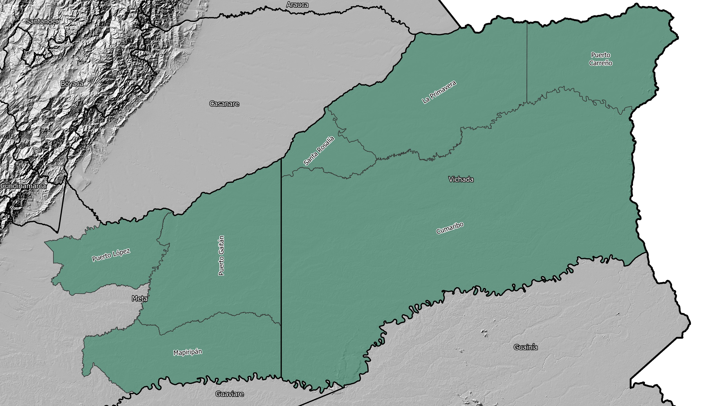

# Investigación Altillanura Colombiana

## 1. Delimitación geográfica

### 1.1. Delimitación Conpes 3797 de 2014 

De acuerdo con Gaviria (1993), la región de la Altillanura corresponde al territorio conformado por sabanas unos metros más altos que el cauce del río Meta, con una red hidrográfica autónoma de tal manera que en la temporada de lluvias estas sabanas no se inundan como sí lo hacen las de la margen izquierda del río Meta. Esta delimitación es la adoptada por el CONPES 3797 (2014), como una subregión de la Orinoquía, definida como un territorio de 135.000 km² y siete municipios del departamento del Meta y Vichada.

Departamento del Meta (municipios)

* Puerto López
* Puerto Gaitán
* Mapiripán

Departamento del Vichada (municipios)

* La Primavera
* Cumaribo
* Santa Rosalía
* Puerto Carreño

### 1.2. Delimitación Instituto Humboldt de 2013

El Instituto Humboldt (2013) define el área geográfica de la Altillanura colombiana, como la región que se extiende desde el municipio de Puerto López y San Martin por el Oeste, al Norte sobre la margen del Río Meta, al Sur la margen del Río Guaviare hasta la desembocadura en el Orinoco en los departamentos de Meta y Vichada, conformado por los siguientes municipios con una extensión total de 143.042 km²:

Departamento del Meta (municipios)

* Puerto López
* Puerto Gaitán
* Mapiripán
* San Martin

Departamento del Vichada (municipios)

* La primavera
* Cumaribo
* Santa Rosalía
* Puerto Carreño
* Puerto Concordia

### 1.3. Delimitación por departamentos Orinoquía Colombiana

La Orinoquía por su parte abarca el área colombiana de la gran cuenca del río Orinoco y a partir de la división político-administrativa del país, comprende los departamentos de Arauca, Casanare, Vichada, Meta, Guaviare y Guainía con una extensión total de 380.600 km².

### 1.4. Delimitación por subzonas hidrográficas Orinoquía Colombiana

## Coberturas geográficas

* Zonificación de tierras del departamento del Meta, IGAC. Escala 1:100.000
* [ICDE - Tipo de utilización de tierra Altillanura](https://www.icde.gov.co/buscador?search_api_fulltext=altillanura)
* Áreas de minería e hidrocarburos, Agencia Nacional de Hidrocarburos - ANH
* Mapa Nacional de Suelos Negros, Instituto Geográfico Agustín Codazzi - IGAC
* Eventos minas antipersonal en Colombia, Departamento Administrativo de la Presidencia de la República - DAPRE
* Centros poblados y cabeceras municipales de Colombia, Instituto Geográfico Agustín Codazzi - IGAC 
* Red Vial de Colombia, Instituto Nacional de Vías - INVIAS
* [Coberturas y uso de las tierras altillanura 2013, Instituto Geográfico Agustín Codazzi - IGAC](https://mapas.igac.gov.co/server/rest/services/agrologia/coberturasyusodelastierrasaltillanura2013/MapServer/WFSServer)

## Cartografía base

* Departamentos de Colombia. IGAC 30/06/2024. https://www.colombiaenmapas.gov.co/
* Municipios, Distritos y Áreas no municipalizadas de Colombia. IGAC 30/06/2024. https://www.colombiaenmapas.gov.co/
* Parque Nacional Natural. Parques Nacionales Naturales - PNN 01/01/2020. https://www.colombiaenmapas.gov.co/

## References

* [Documento Conpes 3797, Política para desarrollo integral de la Orinoquía: Altillanura - Fase I. DNP](https://colaboracion.dnp.gov.co/CDT/Conpes/Econ%C3%B3micos/3797.pdf)
* [Manejo y usos de los suelos de la Altillanura Colombiana, Centro Internacional de Agricultura Tropical - CIAT, 2004.](http://ciat-library.ciat.cgiar.org/Articulos_Ciat/degradacion_capa_arable.pdf)
* https://tiendavirtual.igac.gov.co/en/content/la-altillanura-colombiana-aspectos-biof%C3%ADsicos
* https://www.uniandes.edu.co/es/noticias/ambiente-y-sostenibilidad/la-altillanura-puede-ser-lider-en-desarrollo-del-pais-por-su-adelanto-agricola
* https://www.colombiaenmapas.gov.co/
* [Cobertura vegetal y usos del suelo de la altillanura plana de los municipios de Puerto López y Puerto Gaitán, Meta. Escala 1:25.000](https://repository.agrosavia.co/bitstream/handle/20.500.12324/1267/45474_62372.pdf)
* [Evaluación ambiental estratégica del sector agropecuario - Altillanura y alta montaña cundiboyacense. Instituto de Investigación de Recursos Biológicos Alexander Von Humboldt.](https://www.minambiente.gov.co/wp-content/uploads/2022/04/10.-EAE-Sector-agropecuario-altillanura-y-alta-montana-cundiboyacense.pdf)
* [Unidad de planificación rural aropecuaria - UPRA, Geoservicios](https://geoservicios.upra.gov.co/arcgis/rest/services)
* [ISRIC World Soil Information - Global Assessment of Human-induced Soil Degradation (GLASOD)](https://data.isric.org/geonetwork/srv/eng/catalog.search#/metadata/9e84c15e-cb46-45e2-9126-1ca38bd5cd22)
