# Investigación Altillanura Colombiana

La Orinoquia es una región diversa que incluye la Altillanura, conocida por sus sabanas y ecosistemas únicos. La Altillanura se distingue por su potencial agrícola y su biodiversidad, con un clima tropical de sabana y una temporada de lluvias bien definida. La región alberga una rica fauna y flora, lo que la convierte en un área de gran interés ecológico y económico.

## 1. Delimitación geográfica

### 1.1. Delimitación Conpes 3797 de 2014 

De acuerdo con Gaviria (1993), la región de la Altillanura corresponde al territorio conformado por sabanas unos metros más altos que el cauce del río Meta, con una red hidrográfica autónoma de tal manera que en la temporada de lluvias estas sabanas no se inundan como sí lo hacen las de la margen izquierda del río Meta. Esta delimitación es la adoptada por el CONPES 3797 (2014), como una subregión de la Orinoquía, definida como un territorio de 135.000 km² y siete municipios del departamento del Meta y Vichada.

Departamento del Meta (municipios)

* Puerto López
* Puerto Gaitán
* Mapiripán

Departamento del Vichada (municipios)

* La Primavera
* Cumaribo
* Santa Rosalía
* Puerto Carreño

### 1.2. Delimitación Instituto Humboldt de 2013

El Instituto Humboldt (2013) define el área geográfica de la Altillanura colombiana, como la región que se extiende desde el municipio de Puerto López y San Martin por el Oeste, al Norte sobre la margen del Río Meta, al Sur la margen del Río Guaviare hasta la desembocadura en el Orinoco en los departamentos de Meta y Vichada, conformado por los siguientes municipios con una extensión total de 143.042 km²:

Departamento del Meta (municipios)

* Puerto López
* Puerto Gaitán
* Mapiripán
* San Martin
* Puerto Concordia

Departamento del Vichada (municipios)

* La primavera
* Cumaribo
* Santa Rosalía
* Puerto Carreño

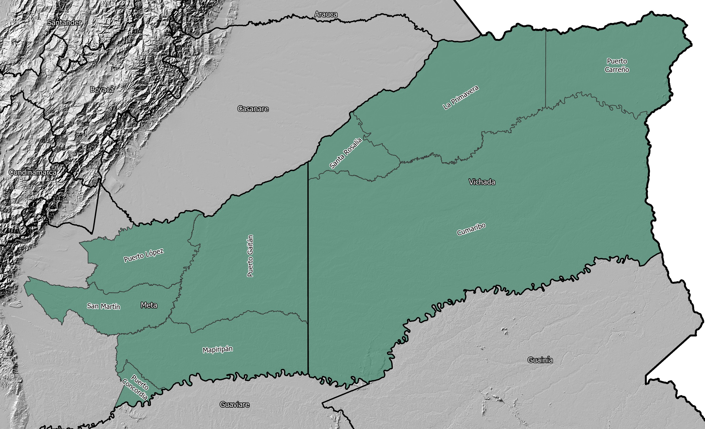

### 1.3. Delimitación por departamentos Orinoquía Colombiana

La Orinoquía por su parte abarca el área colombiana de la gran cuenca del río Orinoco y a partir de la división político-administrativa del país, comprende los departamentos de Arauca, Casanare, Vichada, Meta, Guaviare y Guainía con una extensión total de 380.600 km², correspondientes a 71 municipios.

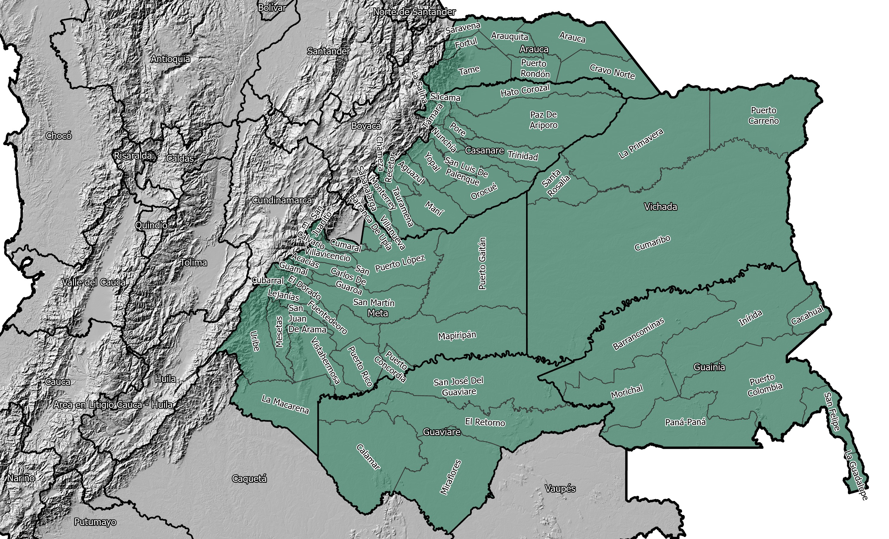

### 1.4. Delimitación por subzonas hidrográficas Orinoquía Colombiana

Definición a partir de las subzonas hidrográficas del IDEAM - 2013 para la zona hidrográfica Orinoquía.

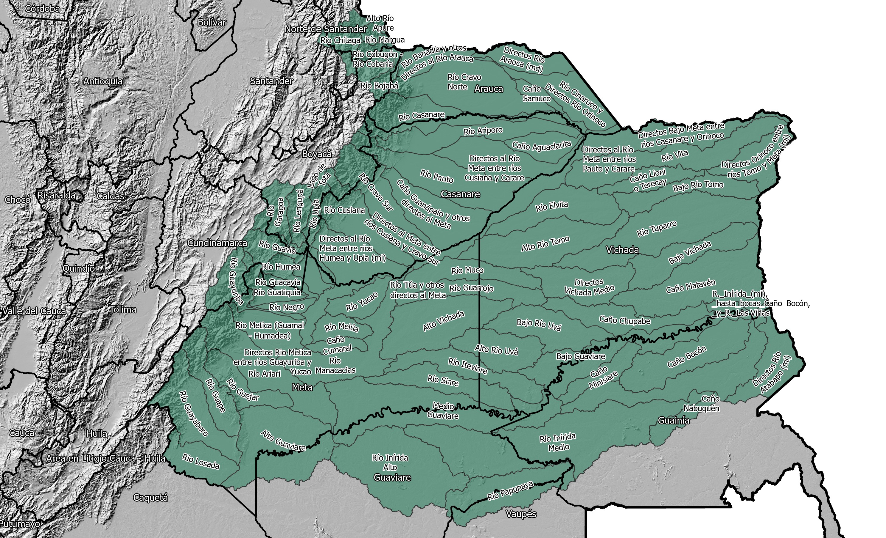

## 2. Coberturas geográficas

### 2.1. Modelo digital de elevación DEM - SRTM NASA

La Misión Topográfica Shuttle Radar (acrónimo en inglés SRTM, de Shuttle Radar Topography Mission) es un proyecto internacional entre la Agencia Nacional de Inteligencia-Geoespacial, NGA, y la Administración Nacional de la Aeronáutica y del Espacio, NASA. Su fin es obtener un modelo digital de elevación de la zona del globo terráqueo entre 56 °S a 60 °N, de modo que genere una completa base de mapas topográficos digitales de alta resolución de la Tierra. Esta base cartográfica ha sido ampliamente utilizada en diferentes campos del conocimiento relacionados con la geomática al poderse descargar gratuitamente a través de Internet. [^1]

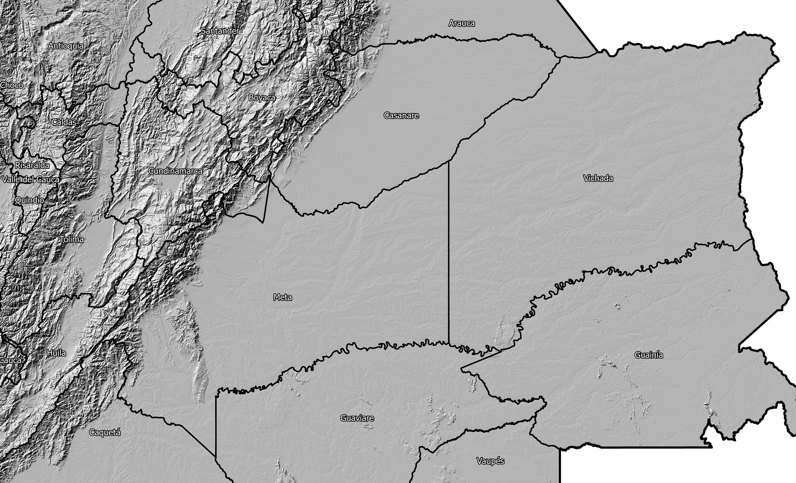

### 2.2. Vocación de Uso territorio Nacional -  Instituto Geográfico Agustín Codazzi - IGAC

El mapa de Vocación de Uso de las tierras se determina mediante matrices de decisión que incluyen indicadores e índices de su estado. En los atributos geo gráficos considerados se encuentra el clima y la pendiente. Entre los de los suelos sobresalen la erosión, humedad, granulometría, pedregosidad, profundidad efectiva, fertilidad y salinidad. Esta clasificación comprende 5 clases: agrícola, ganadera, agroforestal, forestal y de conservación/recuperación. En cada una se establece el uso principal que debe tener. Este producto es generado por la Subdirección de Agrología del Instituto Geográfico Agustín Codazzi - IGAC, para el territorio nacional, el cual fue publicado en la obra Suelos y Tierras de Colombia 2016 a escala 1:100.000.

* Nivel de detalle: 1:100.000
* Fecha de Elaboración: 31-12-2013

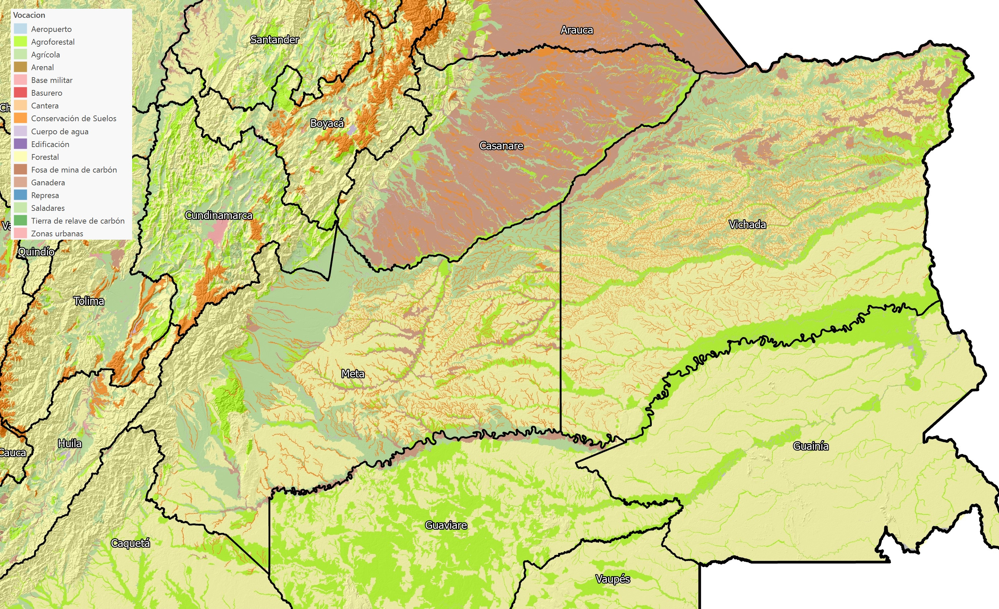

### 2.3. ISRIC World Soil Information - Global Assessment of Human-induced Soil Degradation (GLASOD)

Estudio FAO de degradación inducida mundial de suelos de 1990. [^2]

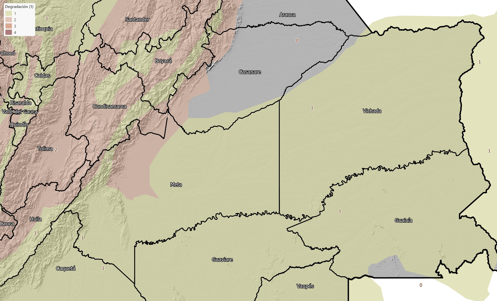

### 2.4. Parques Nacionales Naturales - PNN

El mapa digital Parques Nacionales Naturales según categoría, perteneciente al Sistema de Información Geográfica para la Planeación y el Ordenamiento Territorial - SIGOT, contiene información a nivel municipal referente al tipo de categoría de Parque Nacional Natural (Reserva Natural, Área Natural Única, Santuario de Flora, Santuario de Fauna y Vía Parque) para el año 2017. Información proporcionada por Parques Nacionales Naturales de Colombia.

* Fecha de Elaboración: 01-01-2020

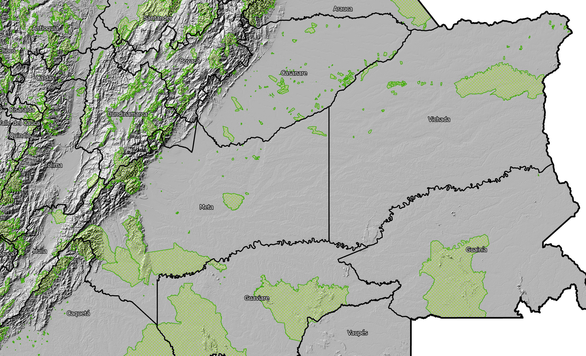

### 2.5. Áreas de minería e hidrocarburos y bloques de exploración petrolera , Agencia Nacional de Hidrocarburos - ANH

La asignación de áreas para el desarrollo de actividades mineras (solicitudes y títulos vigentes) y de hidrocarburos (exploración y explotación), es un tema territorial de gran relevancia actual y futura de acuerdo con las propuestas de uso que se realicen, bajo las consultas específicas tanto con las correspondientes agencias nacionales como con las corporaciones autónomas regionales, con el objeto de identificar el estado de licenciamiento ambiental correspondiente. A través de los títulos mineros como figura, el Estado concede el derecho a explorar y explotar los recursos naturales minerales. Por su parte el sector de hidrocarburos comprende el conjunto de actividades relacionadas con: exploración, producción, transporte, refinación o procesamiento y comercialización de los recursos naturales no renovables. (AGENCIA NACIONAL DE HIDROCARBUROS, s.f).

* Fecha de Elaboración: 30-12-2021

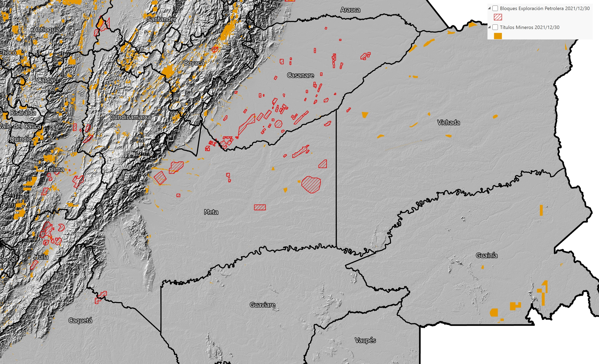

### 2.6. Vías férreas - Instituto Geográfico Agustín Codazzi - IGAC

Tomadas de Base de datos vectorial básica. Colombia. Escala 1:100.000 de Instituto Geográfico Agustín Codazzi - IGAC.

Cartografía vectorial a escala 1:100.000 con cobertura total de la República de Colombia. Contiene información sobre entidades territoriales, transporte terrestre y fluvial, hidrografía, relieve, orografía, construcciones. Se genera a partir de la interpretación de objetos en una imagen ortorectificada provenientes de plataformas satelitales o aerotransportadas.

* Nivel de detalle: 1:100.000
* Fecha de Elaboración: 01-04-2022

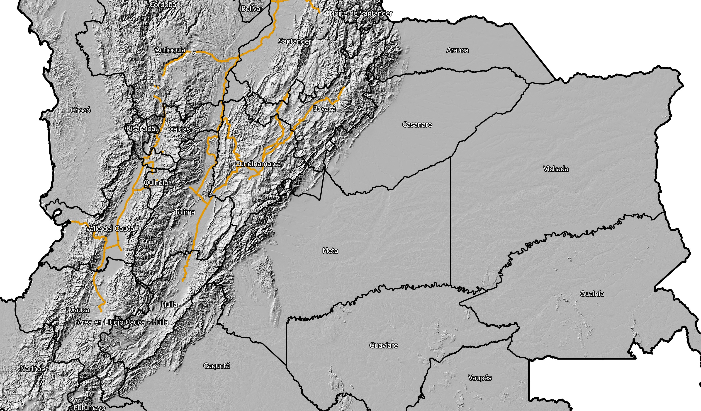

### 2.7. Red vial nacional - Instituto Geográfico Agustín Codazzi - IGAC

Tomadas de Base de datos vectorial básica. Colombia. Escala 1:100.000 de Instituto Geográfico Agustín Codazzi - IGAC.

Cartografía vectorial a escala 1:100.000 con cobertura total de la República de Colombia. Contiene información sobre entidades territoriales, transporte terrestre y fluvial, hidrografía, relieve, orografía, construcciones. Se genera a partir de la interpretación de objetos en una imagen ortorectificada provenientes de plataformas satelitales o aerotransportadas.

* Nivel de detalle: 1:100.000
* Fecha de Elaboración: 01-04-2022

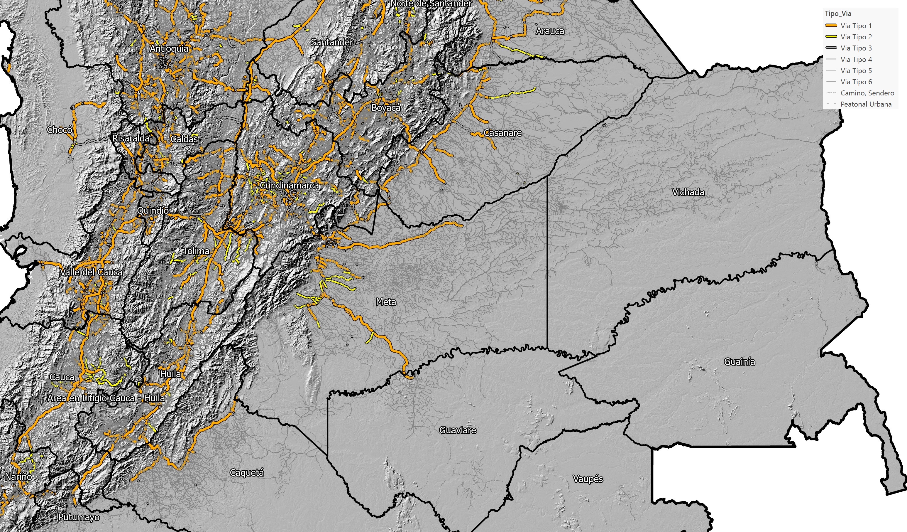

### 2.8. Red vial de Colombia - Instituto Nacional de Vías - INVIAS

Mapa digital de La Red Vial Nacional de Carreteras que esta conformada por las troncales, transversales y accesos a capitales de Departamento que cumplen la función básica de integración de las principales zonas de producción y consumo del país y de éste con los demás países.

* Fecha de Elaboración: 01-01-2016

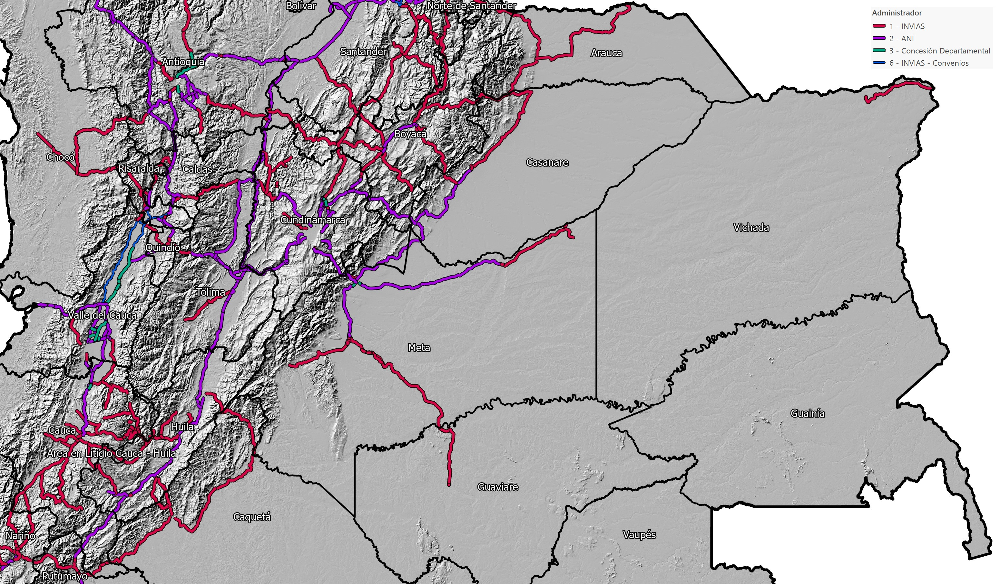

Ruta 40 y ruta 65

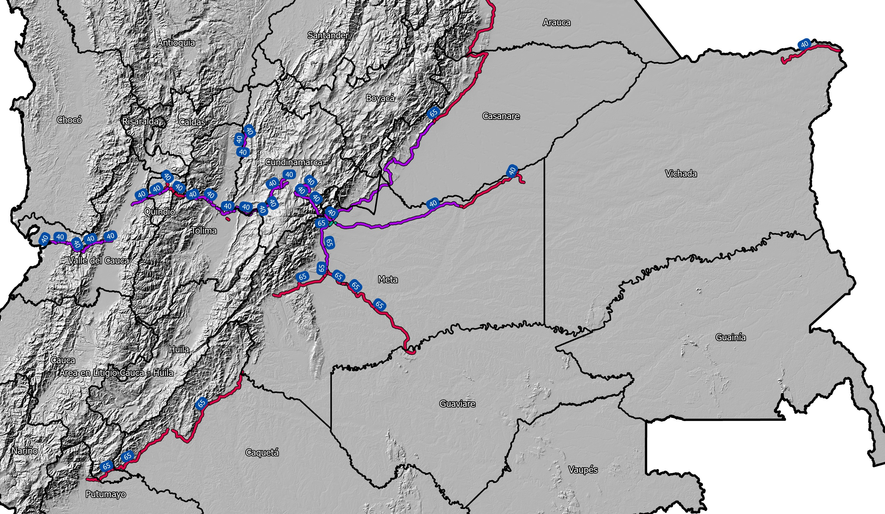

### 2.9. Red de drenaje - Instituto Geográfico Agustín Codazzi - IGAC

Tomadas de Base de datos vectorial básica. Colombia. Escala 1:100.000 de Instituto Geográfico Agustín Codazzi - IGAC.

Cartografía vectorial a escala 1:100.000 con cobertura total de la República de Colombia. Contiene información sobre entidades territoriales, transporte terrestre y fluvial, hidrografía, relieve, orografía, construcciones. Se genera a partir de la interpretación de objetos en una imagen ortorectificada provenientes de plataformas satelitales o aerotransportadas.

* Nivel de detalle: 1:100.000
* Fecha de Elaboración: 01-04-2022

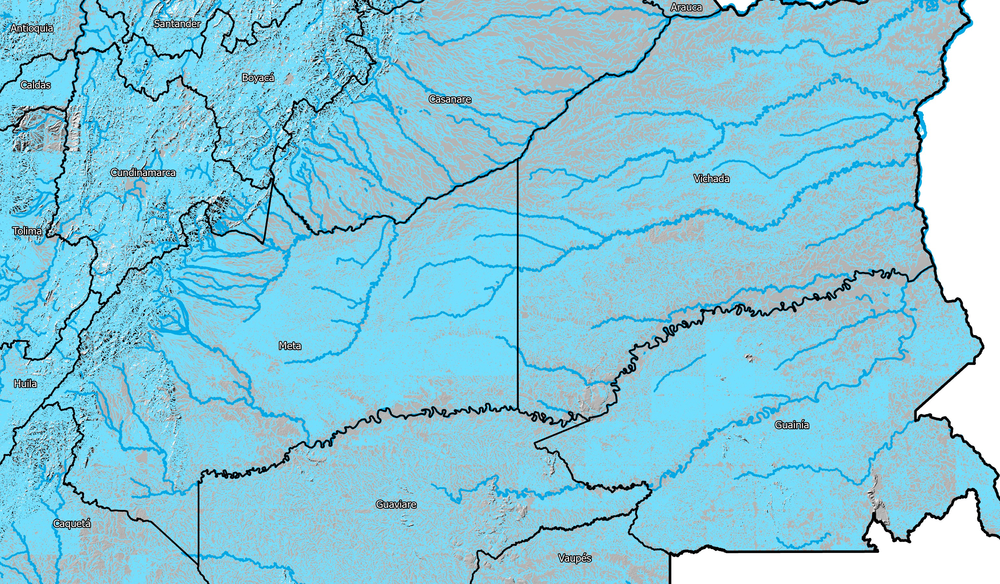

### 2.10. Centros poblados y cabeceras municipales de Colombia, Departamento Administrativo Nacional de Estadística - DANE

Cabeceras y centros poblados de Colombia delimitados por el DANE dentro del Marco Geoestadístico Nacional año 2020. Las cabeceras municipales son áreas geográficas delimitadas por el perímetro censal. A su interior se localiza la sede administrativa del municipio, es decir la alcaldía. Los centros poblados son concentraciones mínimas de veinte (20) viviendas contiguas, vecinas o adosadas entre sí, ubicados en el área resto municipal o en un área no municipalizada.

* Fecha de Elaboración: 31-12-2020

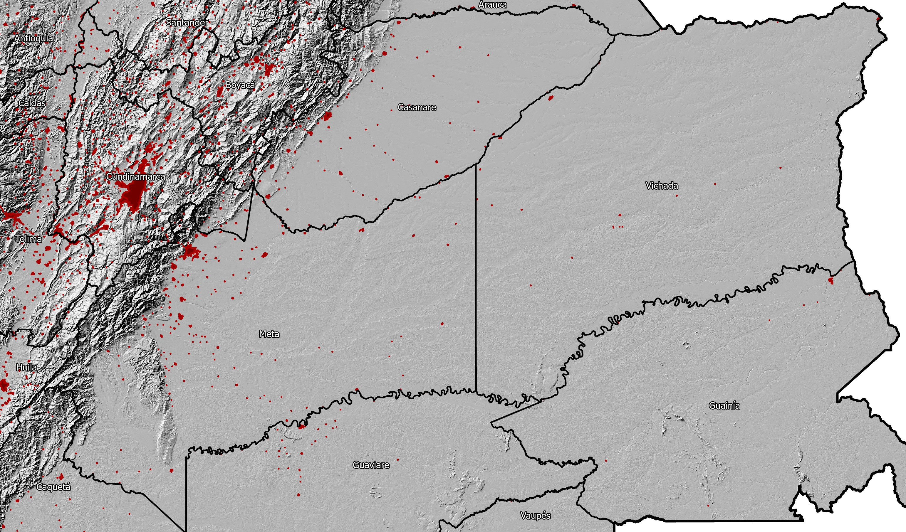

### 2.11. Eventos minas antipersonal en Colombia, Departamento Administrativo de la Presidencia de la República - DAPRE

Eventos por presencia o sospecha de presencia de minas antipersonal (MAP), artefactos explosivos improvisado (AEI) con características de minas antipersonal y municiones sin explotar (MUSE) en Colombia en el periodo comprendido entre 1990 al mes anterior de la fecha de corte. Estos datos son dispuestos por el Departamento Administrativo de la Presidencia de la República - DAPRE.

* Fecha de Elaboración: 23-03-2021

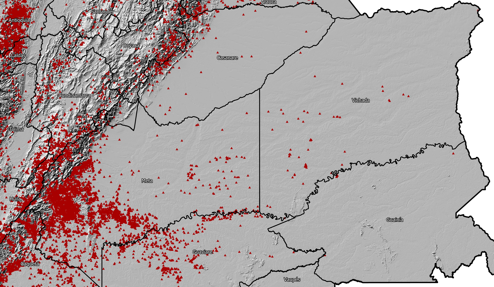

### 2.12. Mapa Nacional de Suelos Negros, Instituto Geográfico Agustín Codazzi - IGAC

El mapa de suelos negros es una iniciativa mundial de la Organización de las Naciones Unidas para la Alimentación y la Agricultura (FAO), con el fin de establecer pautas de manejo sobre el recurso más importante en la seguridad alimentaria.

En Colombia el mapa se finalizó en el 2021, con información de 6322 perfiles a nivel nacional, y permite conocer la distribución de las condiciones actuales de los suelos y sus limitantes de uso.  Lo anterior, facilitará tomar decisiones de protección sobre el recurso, valorando sus beneficios como fertilidad, lo que evitaría la utilización de fertilizantes de alto costo e impacto, servicio ecosistémico en la mitigación al cambio climático y la regulación hídrica, así como implementar manejos que permitan disminuir los procesos de erosión que lo atañen por manejos antrópicos inadecuados o por fenómenos naturales.

Es así, que el mapa de suelos negros, tanto a nivel nacional,como su integración a nivel mundial, permitirá dimensionar las zonas con potencial agrícola, así como la despensa de alimentos y por ende la seguridad alimentaria de la nación. 

* Nivel de detalle: 1:1.000.000
* Fecha de Elaboración: 06-07-2022

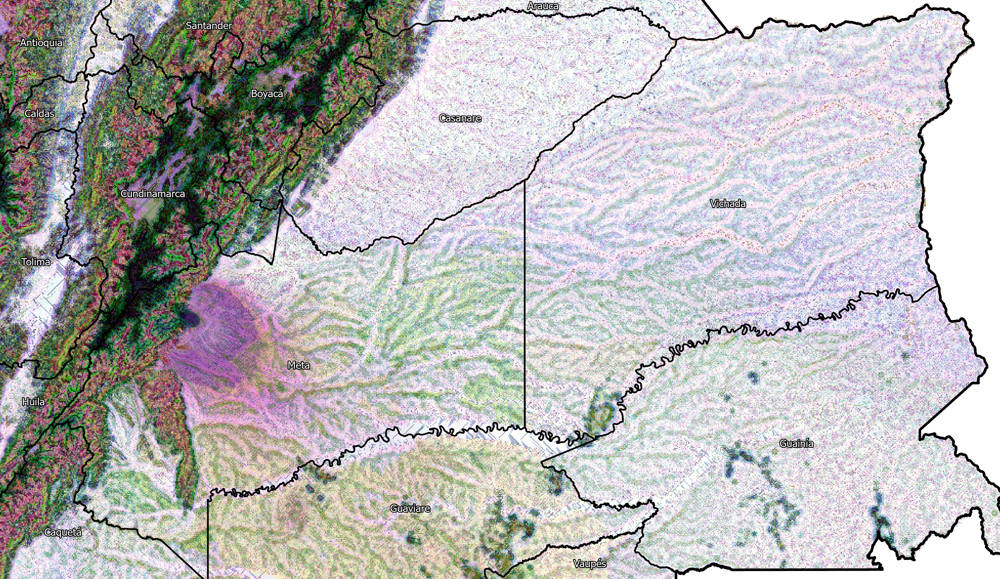

## 3. Políticas 

En el año 2014 el gobierno nacional, a través del Consejo Nacional de Política Económica y Social (COPNES), dentro del marco del Plan Nacional de Desarrollo “Prosperidad para Todos”, presentó el documento con la Política para el Desarrollo Integral de la Orinoquía: Altillanura Fase I. El propósito sus lineamientos es crear las condiciones sociales y económicas para el desarrollo incluyente y sostenible de la Altillanura, basado en la construcción de un modelo de región a partir del equipamiento en infraestructura y servicios sociales, el ordenamiento territorial acorde a la vocación de la región, la generación de condiciones que incentiven la inversión para aprovechar el potencial agropecuario y agroindustrial y la ampliación de las capacidades institucionales para la gestión del desarrollo regional.

The Nature Conseervancy en conjunto con 20 organizaciones ambientales que hacen parte del Pacto Orinoquia Sostenible, entre ellas el Ministerio de Agricultura y Desarrollo Rural, el Proyecto Biocarbono Orinoquia, TFA, WWF, WCS, Fondo Acción, IAVH, Asorinoquia, GGGI4 y Ecopetrol, presentaron en el año 2021 el Manifiesto por el Desarrollo Sostenible de la Orinoquia que representa un compromiso colectivo para asegurar que el crecimiento de la región se realice de manera armónica con su riqueza natural y cultural. El manifiesto que busca promover el desarrollo sostenible en la región de la Orinoquía en Colombia, enfocándose en un desarrollo económico que respete y conserve la biodiversidad y los ecosistemas locales, beneficiando a sus comunidades. Sus intenciones incluyen fomentar la colaboración entre diversos actores, como gobiernos, organizaciones sociales y el sector privado, además de impulsar la educación ambiental y proteger los territorios de pueblos indígenas y campesinos mediante su participación en decisiones. Las políticas propuestas abarcan la implementación de prácticas sostenibles en agricultura y ganadería, la preservación de ecosistemas estratégicos, la promoción de investigación e innovación en gestión ambiental, y la creación de políticas públicas que prioricen la sostenibilidad y el bienestar socioeconómico. 

## 4. Potencial agrícola y vocación de uso del suelo

La Altillanura posee un gran potencial para el aprovechamiento agrícola, pecuario y forestal. Dentro de los cultivos predominantes en la región se encuentra la palma de aceite, caucho, soya y maíz. La región es apta para la ganadería extensiva. La combinación de estos factores hace que la Altillanura sea una zona con capacidad para el desarrollo agroindustrial de Colombia. Es importante mencionar que el aprovechamiento del suelo ha sido limitado por los elevados niveles de acidez del suelo, el bajo contenido de materia orgánica y minerales, y la fuerte temporada seca entre diciembre y marzo que se intensifica al oriente de la región.

## 5.  Pérdida de capacidad y productividad del suelo. Capa arable.

La región enfrenta desafíos significativos relacionados con la pérdida de capacidad del suelo debido a prácticas agrícolas inadecuadas, deforestación y erosión. La implementación de técnicas de agricultura sostenible, como la rotación de cultivos y el uso de abonos orgánicos, es crucial para mantener la fertilidad del suelo y prevenir su degradación.

## 6. Infraestructura

La infraestructura vial en la Altillanura es limitada, las carreteras y vías existentes son esenciales para el transporte de productos agrícolas, pero su estado actual dificulta el desarrollo económico y la conectividad regional.

## 7. Potencial hídrico

La Altillanura cuenta con un considerable potencial hídrico gracias a sus ríos y cuerpos de agua, que son vitales para la agricultura y el abastecimiento de agua.

## 8. Zonas protegidas

En la región se encuentran varias zonas protegidas y parques naturales que promueven la conservación de la biodiversidad y los ecosistemas, preservando la flora y fauna locales.

## References

* [Documento Conpes 3797, Política para desarrollo integral de la Orinoquía: Altillanura - Fase I. DNP](https://colaboracion.dnp.gov.co/CDT/Conpes/Econ%C3%B3micos/3797.pdf)
* [Manejo y usos de los suelos de la Altillanura Colombiana, Centro Internacional de Agricultura Tropical - CIAT, 2004.](http://ciat-library.ciat.cgiar.org/Articulos_Ciat/degradacion_capa_arable.pdf)
* https://tiendavirtual.igac.gov.co/en/content/la-altillanura-colombiana-aspectos-biof%C3%ADsicos
* https://www.uniandes.edu.co/es/noticias/ambiente-y-sostenibilidad/la-altillanura-puede-ser-lider-en-desarrollo-del-pais-por-su-adelanto-agricola
* https://www.colombiaenmapas.gov.co/
* [Cobertura vegetal y usos del suelo de la altillanura plana de los municipios de Puerto López y Puerto Gaitán, Meta. Escala 1:25.000](https://repository.agrosavia.co/bitstream/handle/20.500.12324/1267/45474_62372.pdf)
* [Evaluación ambiental estratégica del sector agropecuario - Altillanura y alta montaña cundiboyacense. Instituto de Investigación de Recursos Biológicos Alexander Von Humboldt.](https://www.minambiente.gov.co/wp-content/uploads/2022/04/10.-EAE-Sector-agropecuario-altillanura-y-alta-montana-cundiboyacense.pdf)
* [Unidad de planificación rural aropecuaria - UPRA, Geoservicios](https://geoservicios.upra.gov.co/arcgis/rest/services)
* [ISRIC World Soil Information - Global Assessment of Human-induced Soil Degradation (GLASOD)](https://data.isric.org/geonetwork/srv/eng/catalog.search#/metadata/9e84c15e-cb46-45e2-9126-1ca38bd5cd22)
* Departamentos de Colombia. IGAC 30/06/2024. https://www.colombiaenmapas.gov.co/
* Municipios, Distritos y Áreas no municipalizadas de Colombia. IGAC 30/06/2024. https://www.colombiaenmapas.gov.co/
* Zonificación de tierras del departamento del Meta, IGAC. Escala 1:100.000
* [ICDE - Tipo de utilización de tierra Altillanura](https://www.icde.gov.co/buscador?search_api_fulltext=altillanura)
* Mapa Nacional de Suelos Negros, Instituto Geográfico Agustín Codazzi - IGAC
* Eventos minas antipersonal en Colombia, Departamento Administrativo de la Presidencia de la República - DAPRE
* [Coberturas y uso de las tierras altillanura 2013, Instituto Geográfico Agustín Codazzi - IGAC](https://mapas.igac.gov.co/server/rest/services/agrologia/coberturasyusodelastierrasaltillanura2013/MapServer/WFSServer)

[^1]: https://es.wikipedia.org/wiki/Misi%C3%B3n_topogr%C3%A1fica_Radar_Shuttle
[^2]: https://data.isric.org/geonetwork/srv/eng/catalog.search#/metadata/9e84c15e-cb46-45e2-9126-1ca38bd5cd22